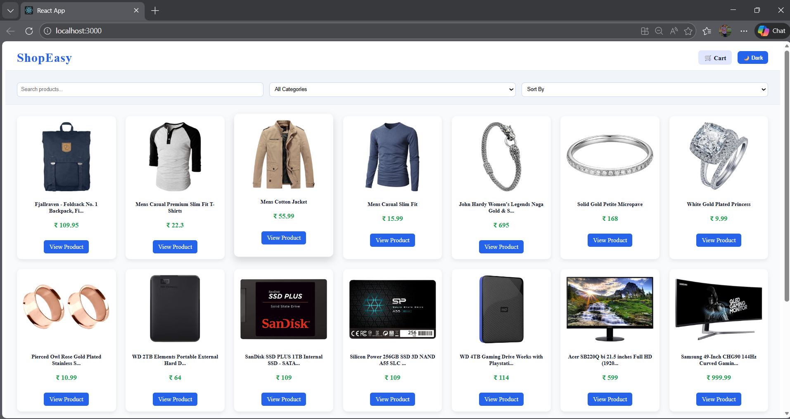
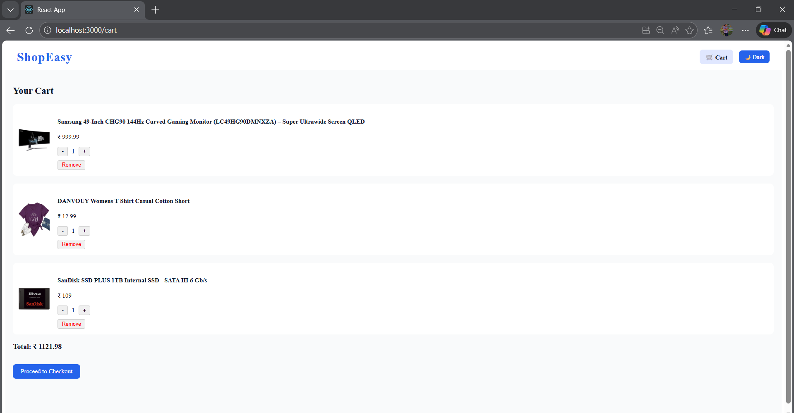
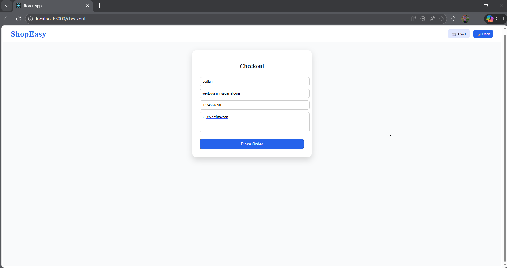
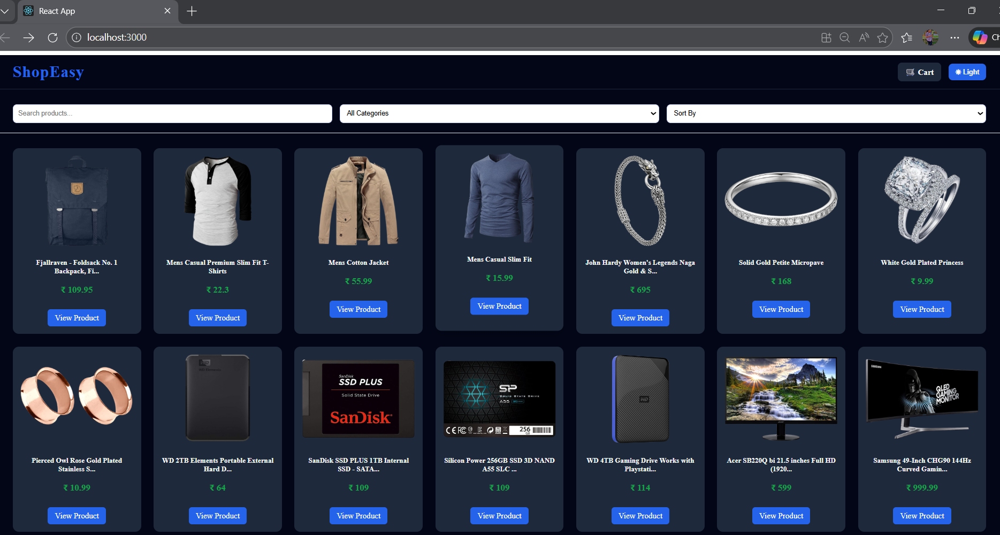

# 🛒 ShopEasy – React E-Commerce Website

A complete React-based E-Commerce web application built as a **Week-7 Capstone Project**.

---

## 🚀 Live Demo
👉 https://dulcet-griffin-0dbc1a.netlify.app

---

## 📌 Features

- Product Listing using FakeStore API
- Search, Filter, and Sort products
- Product Details page
- Cart functionality (Add / Remove / Update)
- Checkout form with validation
- Light & Dark Mode
- Responsive design (Mobile, Tablet, Desktop)
- Deployed live using Netlify

---

## 🛠 Tech Stack

- React
- JavaScript
- CSS
- FakeStore API
- Zustand (Global State)
- Netlify (Deployment)

---

## 📸 Screenshots

### Home Page

### Product Details

### Cart Page

### Checkout Page

### Dark Mode

